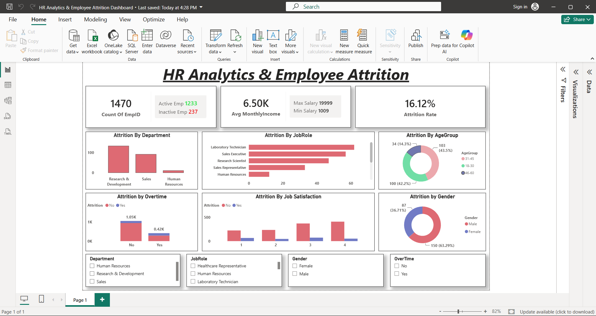

# HR Analytics & Employee Attrition Dashboard

## 📌 Project Overview

This project focuses on analyzing employee data to understand workforce characteristics and factors associated with employee attrition.

The project uses **Excel, SQL, and Power BI** to analyze employee data and create an interactive dashboard that presents key HR insights through visualizations and KPIs.

## 🛠️ Tools & Technologies

* **Excel** – Used for data preparation and creating the Age Group column
* **SQL Server** – Used for data analysis and querying
* **Power BI** – Used to create the interactive dashboard
* **DAX** – Used to create measures and calculated columns

## 📊 Dataset

The dataset used for this project is the **HR Employee Attrition** dataset obtained from Kaggle.

**Dataset:** `WA_Fn-UseC_-HR-Employee-Attrition`

**Source:** Kaggle

The dataset was used for educational and data analysis purposes.

## 🔍 Analysis Performed

The project analyzes several aspects of employee data, including:

* Employee count
* Employee attrition
* Attrition rate
* Department-wise employee analysis
* Age group analysis
* Monthly income
* Job roles
* Overtime
* Job satisfaction
* Workforce demographics

## 📈 Power BI Dashboard

The Power BI dashboard provides an interactive view of employee attrition and workforce characteristics.

### Dashboard Preview

## 💡 Key Skills Demonstrated

* Data analysis using SQL
* Data preparation using Excel
* SQL Server
* Power BI dashboard development
* DAX measures
* Calculated columns
* Data visualization
* KPI development
* Workforce and attrition analysis

## 📁 Project Files

* **HR_Attrition_Dashboard.pbix** – Power BI dashboard file
* **dashboard.png** – Dashboard preview
* **README.md** – Project documentation

## 🎯 Project Objective

The objective of this project is to analyze employee data and present meaningful insights related to employee attrition, income, job satisfaction, overtime, departments, and workforce demographics using data analysis and visualization techniques.
